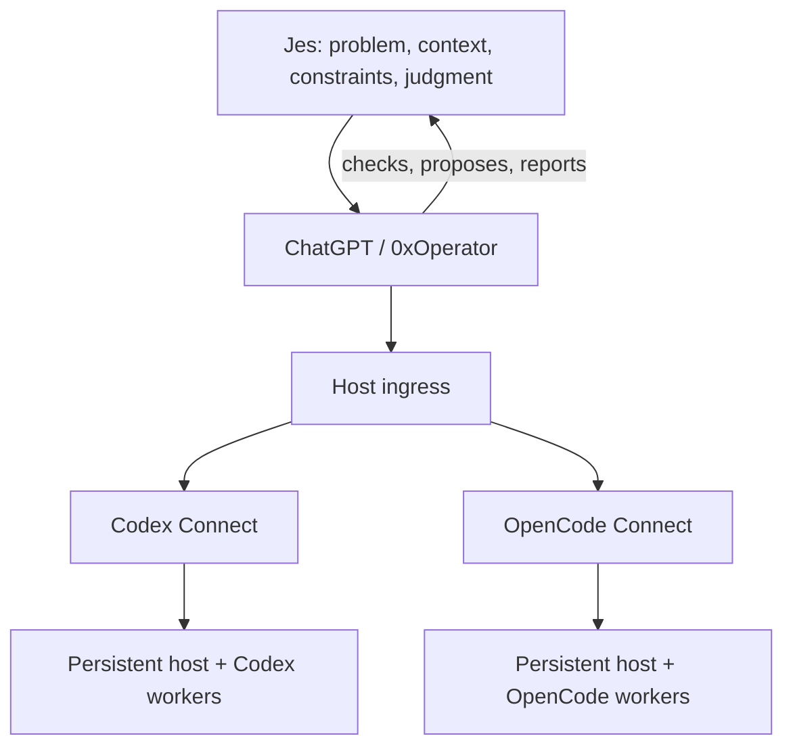

# Jesrey Olmedo — AI-Assisted Workflow Builder

I work on messy operational workflows and use AI to turn them into simpler,
repeatable systems.

I am not a traditional software engineer, and I do not present myself as one. I am
strongest when I can see how work actually happens, ask the questions that uncover
the real friction, challenge weak assumptions, and keep redirecting until the
workflow is simpler and useful.

I rarely begin with a formal technical specification. I start with the operation:
what people are trying to do, what keeps getting in the way, what should stay
untouched, and what a better workflow would feel like. AI handles much of the
technical investigation and implementation while I keep steering the work.

## Flagship system: 0xOperator

0xOperator is my self-hosted AI operations environment. In practical terms, I can
describe an operational goal in ChatGPT—inspect a machine, diagnose a service,
change a configuration, run tests, prepare a release, or investigate a technical
problem—and carry that workflow through the same operator instead of manually
shuttling context between chat, terminals, and coding agents.

ChatGPT runs as the primary operator over a persistent host and can hand off coding
or review work to Codex and OpenCode without mixing up their sessions, permissions,
or state.

The point is not any single tool. It is how the work is split up: direct host
actions stay separate from delegated agent work, each runtime is used the way it
was designed to be used, interrupted work can be recovered, and results are
checked where they actually run.

Today I use this environment to maintain the system itself: inspecting live
services, directing repository changes, running test and deployment steps,
recovering interrupted work, and comparing Codex and OpenCode on real tasks.

## How I work with AI

I bring the problem and the context. I ask questions, challenge proposed
approaches, redirect work when it starts solving the wrong problem, and decide
whether the result is actually useful in practice.

ChatGPT acts as the technical operator. It translates that direction into
technical steps, coordinates coding agents when useful, and checks the result
against the live system.

I do not claim to be the engineer manually writing most of that implementation.
What I am demonstrating is the ability to take a specific operational problem,
work through it with capable AI tools, and end up with something that works without
unnecessarily disturbing the broader system around it.

## Case studies

### [Host ingress](case-studies/host-ingress.md)

Secure identity, routing, and transport boundary for self-hosted AI connectors.

Repository: https://github.com/Jesrey0/host-ingress

### [Codex Connect](case-studies/codex-connect.md)

Persistent host control with coding and review handoffs to the official Codex
runtime.

Repository: https://github.com/Jesrey0/codex-connect

### [OpenCode Connect](case-studies/opencode-connect.md)

A second way to run the same workflow using OpenCode, kept true to how OpenCode
already works instead of forcing it to look like Codex.

Repository: https://github.com/Jesrey0/opencode-connect

### [Private operational workflow](case-studies/private-operations.md)

An anonymized example of applying the same approach to a real organization's
administrative and recordkeeping workflows. Source, documents, identities, and
operational data remain private.

## Working style

- Start from the real workflow, not the tool.
- Ask what is actually broken before deciding what to build.
- Challenge assumptions and proposed solutions instead of accepting the first
  technically valid answer.
- Keep changes local when a local intervention is enough.
- Let ChatGPT work out the technical steps and coordinate the coding agents.
- Verify the result in the environment where it has to work.
- Prefer a simpler working workflow over a more impressive architecture.

## Current target roles

AI Operations · Workflow Automation · Technical Operations · Process Improvement ·
Business / Operations Analysis · AI Adoption / Enablement
