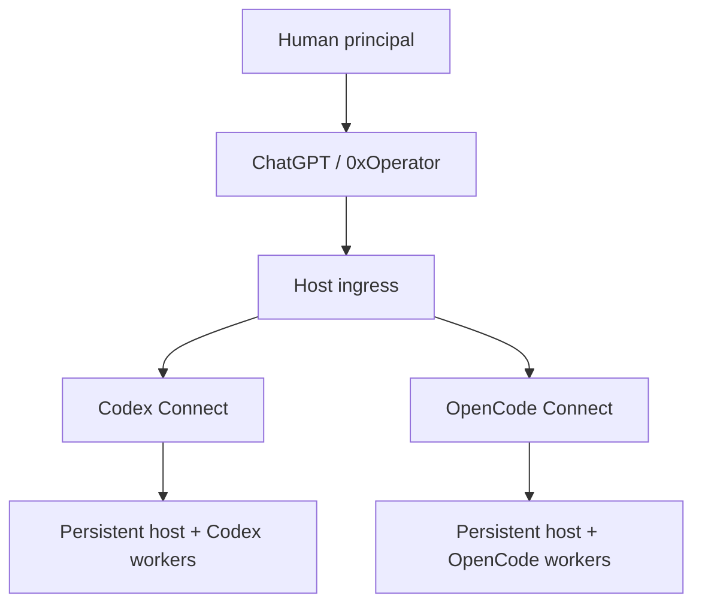

# Jesrey Olmedo — AI-Assisted Workflow Builder

I design practical systems around messy operational workflows, then use AI agents
to help implement, test, review, and iterate on them.

I am not presenting myself as a traditional software engineer. My strongest work
is at the workflow and systems level: clarifying requirements, decomposing
problems, choosing boundaries, directing AI agents, evaluating tradeoffs, and
verifying that the resulting system actually works.

## Flagship system: 0xOperator

0xOperator is my self-hosted AI operations environment. In practical terms, I can
describe an operational goal in ChatGPT—inspect a machine, diagnose a service,
change a configuration, run tests, prepare a release, or investigate a technical
problem—and carry that workflow through the same operator instead of manually
shuttling context between chat, terminals, and coding agents.

ChatGPT acts as the primary operator over a persistent host and can delegate
bounded implementation or review work to multiple AI coding substrates without
collapsing their authority, lifecycle, or state into one opaque agent loop.

The interesting part is not any single framework. It is the operating model:
separating deterministic host actions from delegated cognition, preserving native
runtime semantics, making recovery explicit, and verifying outcomes at the layer
that owns them.

Today I use this environment to maintain the system itself: inspecting live
services, modifying repositories, running deployment/test workflows, recovering
interrupted work, and comparing different AI execution substrates while keeping
one human-directed operating model.

## What I own vs. what AI implements

For these projects, I own the problem definition, requirements, architecture,
constraints, workflow design, decomposition, acceptance criteria, tradeoff
decisions, review direction, and final verification. AI coding agents perform much
of the low-level implementation under that direction.

That distinction is intentional. The capability I am demonstrating is the ability
to take an operational problem from ambiguity to a working, testable system by
orchestrating modern AI tools effectively.

## Case studies

### [Host ingress](case-studies/host-ingress.md)

Secure identity, routing, and transport boundary for self-hosted AI connectors.

Repository: https://github.com/Jesrey0/host-ingress

### [Codex Connect](case-studies/codex-connect.md)

Persistent host control and bounded delegation to the official Codex runtime.

Repository: https://github.com/Jesrey0/codex-connect

### [OpenCode Connect](case-studies/opencode-connect.md)

A second execution substrate designed around OpenCode's own native sessions,
agents, worktrees, permissions, and lifecycle instead of forcing API parity.

Repository: https://github.com/Jesrey0/opencode-connect

### [Private operational workflow](case-studies/private-operations.md)

An anonymized example of applying the same approach to a real organization's
administrative and recordkeeping workflows. Source, documents, identities, and
operational data remain private.

## Working style

- Start from the real workflow, not the tool.
- Make authority and ownership explicit.
- Prefer high-level system design over unnecessary low-level reinvention.
- Give AI agents bounded objectives and concrete acceptance criteria.
- Treat agent output as a proposal until the owning layer verifies it.
- Iterate toward simpler, more reliable operating models.

## Current target roles

Business / Systems Analyst · AI Operations · Workflow Automation · Technical
Operations · Process Improvement · AI Adoption / Enablement
