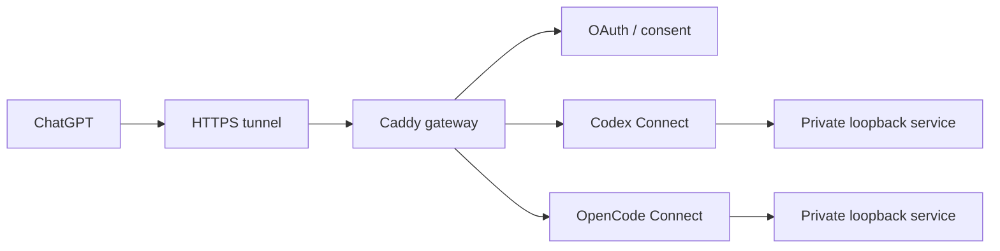

# Case Study — Host ingress

## Problem

I wanted ChatGPT to reach my self-hosted AI connectors without exposing local
administration services directly to the internet. A simple tunnel was not enough:
identity, authorization, routing, and failure isolation still had to be clear.

## My role

My starting constraint was simple: I wanted remote AI tools to reach the services
they needed without casually exposing the rest of the host or turning the ingress
layer into another complicated platform to maintain.

As the design evolved, I kept questioning unnecessary cost, duplicated controls,
and changes that would disturb already-working endpoints. ChatGPT and delegated
agents worked through the networking, authentication, configuration, and review
details. I judged the result by whether it stayed narrow, understandable, and safe
to operate.

## Design

Where the design landed:

- Centralize the public ingress boundary while keeping each backend independently
  deployable.
- Require authenticated, app-specific resources instead of proxying a generic
  local control plane.
- Keep backend listeners private and default-deny undeclared public routes.
- Keep OAuth state isolated per connector even when the host identity is shared.
- Check source, deployment, gateway readiness, and live ChatGPT connection
  separately instead of assuming one proves the others.

## Why it matters

This is the kind of infrastructure change I prefer: solve the narrow problem, add
a safer boundary, and leave the surrounding system alone.

## Verified outcome

The shared ingress currently fronts two independently deployed connector
backends through separate authenticated resources while their raw application
control planes remain private. I had ChatGPT run the gateway and OAuth integration
tests and Caddy configuration checks, then I checked live connections from the
operator side before accepting the change. Source, deployment, gateway readiness,
and successful client connection are checked separately instead of assuming one
proves the others.
