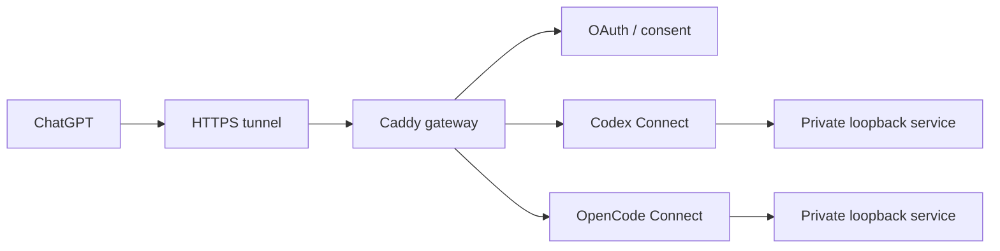

# Case Study — Host ingress

## Problem

I wanted ChatGPT to operate self-hosted AI connectors without exposing raw local
control planes directly to the internet. A simple tunnel was not enough: identity,
authorization, routing, state isolation, and failure boundaries had to remain
explicit.

## My role

I defined the security and operating requirements, chose the major boundaries,
directed AI agents through implementation and adversarial review, and verified the
deployed behavior. The low-level implementation was largely AI-assisted.

## Design

Key choices:

- Centralize the public ingress boundary while keeping each backend independently
  deployable.
- Require authenticated, app-specific resources instead of proxying a generic
  local control plane.
- Keep backend listeners private and default-deny undeclared public routes.
- Keep OAuth state isolated per connector even when the host identity is shared.
- Treat source, deployment, ingress readiness, and live ChatGPT connectivity as
  separate verification states.

## What this demonstrates

Security-boundary thinking, systems decomposition, authentication flow design,
failure isolation, and the ability to direct AI implementation around explicit
operational constraints.

## Verified outcome

The shared ingress currently fronts two independently deployed connector
backends through separate authenticated resources while their raw application
control planes remain private. I verified the design through automated gateway
and OAuth integration tests, Caddy configuration validation, and live connection
checks from the operator environment. The acceptance process treats source,
deployment, ingress readiness, and successful client connection as separate
states rather than assuming one proves the others.
